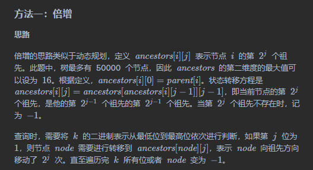

33333333333333333333333333333333

**代码**

* [sol1-Python3]

```Python
class TreeAncestor:

    def __init__(self, n: int, parent: List[int]):
        self.log = 16
        self.ancestors = [[-1] * self.log for _ in range(n)]
        for i in range(n):
            self.ancestors[i][0] = parent[i]
        for j in range(1, self.log):
            for i in range(n):
                if self.ancestors[i][j - 1] != -1:
                    self.ancestors[i][j] = self.ancestors[self.ancestors[i][j - 1]][j - 1]   

    def getKthAncestor(self, node: int, k: int) -> int:
        for j in range(self.log):
            if (k>>j) & 1: 
                node = self.ancestors[node][j]
                if node == -1:
                    return -1
        return node
```

* [sol1-C++]

```C++
class TreeAncestor {
public:
    constexpr static int Log = 16;
    vector<vector<int>> ancestors;

    TreeAncestor(int n, vector<int>& parent) {
        ancestors = vector<vector<int>>(n, vector<int>(Log, -1));
        for (int i = 0; i < n; i++) {
            ancestors[i][0] = parent[i];
        }
        for (int j = 1; j < Log; j++) {
            for (int i = 0; i < n; i++) {
                if (ancestors[i][j - 1] != -1) {
                    ancestors[i][j] = ancestors[ancestors[i][j - 1]][j - 1];
                }
            }
        }        
    }

    int getKthAncestor(int node, int k) {
        for (int j = 0; j < Log; j++) {
            if ((k >> j) & 1) {
                node = ancestors[node][j];
                if (node == -1) {
                    return -1;
                }
            }
        }
        return node;
    }
};
```

* [sol1-Java]

```Java
class TreeAncestor {
    static final int LOG = 16;
    int[][] ancestors;

    public TreeAncestor(int n, int[] parent) {
        ancestors = new int[n][LOG];
        for (int i = 0; i < n; i++) {
            Arrays.fill(ancestors[i], -1);
        }
        for (int i = 0; i < n; i++) {
            ancestors[i][0] = parent[i];
        }
        for (int j = 1; j < LOG; j++) {
            for (int i = 0; i < n; i++) {
                if (ancestors[i][j - 1] != -1) {
                    ancestors[i][j] = ancestors[ancestors[i][j - 1]][j - 1];
                }
            }
        }        
    }

    public int getKthAncestor(int node, int k) {
        for (int j = 0; j < LOG; j++) {
            if (((k >> j) & 1) != 0) {
                node = ancestors[node][j];
                if (node == -1) {
                    return -1;
                }
            }
        }
        return node;
    }
}
```

* [sol1-C#]

```C#
public class TreeAncestor {
    const int LOG = 16;
    int[][] ancestors;

    public TreeAncestor(int n, int[] parent) {
        ancestors = new int[n][];
        for (int i = 0; i < n; i++) {
            ancestors[i] = new int[LOG];
            Array.Fill(ancestors[i], -1);
        }
        for (int i = 0; i < n; i++) {
            ancestors[i][0] = parent[i];
        }
        for (int j = 1; j < LOG; j++) {
            for (int i = 0; i < n; i++) {
                if (ancestors[i][j - 1] != -1) {
                    ancestors[i][j] = ancestors[ancestors[i][j - 1]][j - 1];
                }
            }
        }        
    }

    public int GetKthAncestor(int node, int k) {
        for (int j = 0; j < LOG; j++) {
            if (((k >> j) & 1) != 0) {
                node = ancestors[node][j];
                if (node == -1) {
                    return -1;
                }
            }
        }
        return node;
    }
}
```

* [sol1-Golang]

```Golang
const kLog = 16

type TreeAncestor struct {
    ancestors [][]int
}

func Constructor(n int, parent []int) TreeAncestor {
    var this TreeAncestor
    this.ancestors = make([][]int, n)
    for i := 0; i < n; i++ {
        this.ancestors[i] = make([]int, kLog)
        for j := 0; j < kLog; j++ {
            this.ancestors[i][j] = -1
        }
        this.ancestors[i][0] = parent[i]
    }
    for j := 1; j < kLog; j++ {
        for i := 0; i < n; i++ {
            if this.ancestors[i][j - 1] != -1 {
                this.ancestors[i][j] = this.ancestors[this.ancestors[i][j - 1]][j - 1]
            }
        }
    }
    return this
}

func (this *TreeAncestor) GetKthAncestor(node int, k int) int {
    for j := 0; j < kLog; j++ {
        if (k >> j) & 1 != 0 {
            node = this.ancestors[node][j]
            if node == -1 {
                return -1
            }
        }
    }
    return node
}
```

* [sol1-C]

```C
const int LOG = 16;

typedef struct {
    int **ancestors;
    int n;
} TreeAncestor;

TreeAncestor* treeAncestorCreate(int n, int* parent, int parentSize) {
    TreeAncestor *obj = (TreeAncestor *)malloc(sizeof(TreeAncestor));
    obj->ancestors = (int **)malloc(sizeof(int *) * n);
    for (int i = 0; i < n; i++) {
        obj->ancestors[i] = (int *)malloc(sizeof(int) * LOG);
        memset(obj->ancestors[i], 0xff, sizeof(int) * LOG);
    }
    for (int i = 0; i < n; i++) {
        obj->ancestors[i][0] = parent[i];
    }
    for (int j = 1; j < LOG; j++) {
        for (int i = 0; i < n; i++) {
            if (obj->ancestors[i][j - 1] != -1) {
                obj->ancestors[i][j] = obj->ancestors[obj->ancestors[i][j - 1]][j - 1];
            }
        }
    }  
    return obj;  
}

int treeAncestorGetKthAncestor(TreeAncestor* obj, int node, int k) {
    for (int j = 0; j < LOG; j++) {
        if ((k >> j) & 1) {
            node = obj->ancestors[node][j];
            if (node == -1) {
                return -1;
            }
        }
    }
    return node;
}

void treeAncestorFree(TreeAncestor* obj) {
    for (int i = 0; i < obj->n; i++) {
        free(obj->ancestors[i]);
    }
    free(obj->ancestors);
    free(obj);
}
```

* [sol1-JavaScript]

```JavaScript
const LOG = 16;
var TreeAncestor = function(n, parent) {
    ancestors = new Array(n).fill(0).map(() => new Array(LOG).fill(-1));
    for (let i = 0; i < n; i++) {
        ancestors[i][0] = parent[i];
    }
    for (let j = 1; j < LOG; j++) {
        for (let i = 0; i < n; i++) {
            if (ancestors[i][j - 1] !== -1) {
                ancestors[i][j] = ancestors[ancestors[i][j - 1]][j - 1];
            }
        }
    }             
}

TreeAncestor.prototype.getKthAncestor = function(node, k) {
    for (let j = 0; j < LOG; j++) {
        if (((k >> j) & 1) !== 0) {
            node = ancestors[node][j];
            if (node === -1) {
                return -1;
            }
        }
    }
    return node;
};
```

**复杂度分析**

* 时间复杂度：初始化的时间复杂度是 **O**(**n**×**lo**g**n**)，单次查询的时间复杂度是 **O**(**lo**g**n**)。
* 空间复杂度：初始化的空间复杂度是 **O**(**n**×**lo**g**n**)，单次查询的空间复杂度是 **O**(**1**)。
