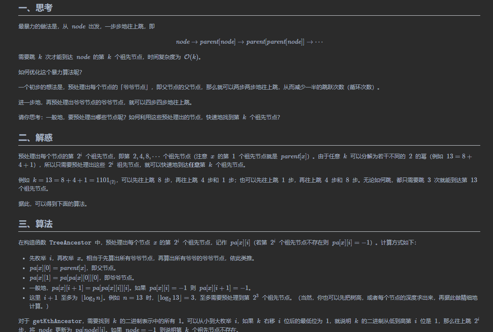

* [sol-Python3]

```py
class TreeAncestor:
    def __init__(self, n: int, parent: List[int]):
        m = n.bit_length() - 1
        pa = [[p] + [-1] * m for p in parent]
        for i in range(m):
            for x in range(n):
                if (p := pa[x][i]) != -1:
                    pa[x][i + 1] = pa[p][i]
        self.pa = pa

    def getKthAncestor(self, node: int, k: int) -> int:
        for i in range(k.bit_length()):
            if (k >> i) & 1:  # k 的二进制从低到高第 i 位是 1
                node = self.pa[node][i]
                if node < 0: break
        return node

    # 另一种写法，不断去掉 k 的最低位的 1
    def getKthAncestor2(self, node: int, k: int) -> int:
        while k and node != -1:  # 也可以写成 ~node
            lb = k & -k
            node = self.pa[node][lb.bit_length() - 1]
            k ^= lb
        return node
```

* [sol-Java]

```java
class TreeAncestor {
    private int[][] pa;

    public TreeAncestor(int n, int[] parent) {
        int m = 32 - Integer.numberOfLeadingZeros(n); // n 的二进制长度
        pa = new int[n][m];
        for (int i = 0; i < n; i++)
            pa[i][0] = parent[i];
        for (int i = 0; i < m - 1; i++) {
            for (int x = 0; x < n; x++) {
                int p = pa[x][i];
                pa[x][i + 1] = p < 0 ? -1 : pa[p][i];
            }
        }
    }

    public int getKthAncestor(int node, int k) {
        int m = 32 - Integer.numberOfLeadingZeros(k); // k 的二进制长度
        for (int i = 0; i < m; i++) {
            if (((k >> i) & 1) > 0) { // k 的二进制从低到高第 i 位是 1
                node = pa[node][i];
                if (node < 0) break;
            }
        }
        return node;
    }

    // 另一种写法，不断去掉 k 的最低位的 1
    public int getKthAncestor2(int node, int k) {
        for (; k > 0 && node != -1; k &= k - 1)
            node = pa[node][Integer.numberOfTrailingZeros(k)];
        return node;
    }
}
```

* [sol-C++]

```cpp
class TreeAncestor {
    vector<vector<int>> pa;
public:
    TreeAncestor(int n, vector<int> &parent) {
        int m = 32 - __builtin_clz(n); // n 的二进制长度
        pa.resize(n, vector<int>(m, -1));
        for (int i = 0; i < n; i++)
            pa[i][0] = parent[i];
        for (int i = 0; i < m - 1; i++)
            for (int x = 0; x < n; x++)
                if (int p = pa[x][i]; p != -1)
                    pa[x][i + 1] = pa[p][i];
    }

    int getKthAncestor(int node, int k) {
        int m = 32 - __builtin_clz(k); // k 的二进制长度
        for (int i = 0; i < m; i++) {
            if ((k >> i) & 1) { // k 的二进制从低到高第 i 位是 1
                node = pa[node][i];
                if (node < 0) break;
            }
        }
        return node;
    }

    // 另一种写法，不断去掉 k 的最低位的 1
    int getKthAncestor2(int node, int k) {
        for (; k && node != -1; k &= k - 1) // 也可以写成 ~node
            node = pa[node][__builtin_ctz(k)];
        return node;
    }
};
```

* [sol-Go]

```go
type TreeAncestor [][]int

func Constructor(n int, parent []int) TreeAncestor {
    m := bits.Len(uint(n))
    pa := make([][]int, n)
    for i, p := range parent {
        pa[i] = make([]int, m)
        pa[i][0] = p
    }
    for i := 0; i < m-1; i++ {
        for x := 0; x < n; x++ {
            if p := pa[x][i]; p != -1 {
                pa[x][i+1] = pa[p][i]
            } else {
                pa[x][i+1] = -1
            }
        }
    }
    return pa
}

func (pa TreeAncestor) GetKthAncestor(node, k int) int {
    m := bits.Len(uint(k))
    for i := 0; i < m; i++ {
        if k>>i&1 > 0 { // k 的二进制从低到高第 i 位是 1
            node = pa[node][i]
            if node < 0 {
                break
            }
        }
    }
    return node
}

// 另一种写法，不断去掉 k 的最低位的 1
func (pa TreeAncestor) GetKthAncestor2(node, k int) int {
    for ; k > 0 && node != -1; k &= k - 1 {
        node = pa[node][bits.TrailingZeros(uint(k))]
    }
    return node
}
```

#### 复杂度分析

* 时间复杂度：预处理 **O**(**n**log**n**)，回答每个询问 **O**(**lo**g**k**)。
* 空间复杂度：预处理需要 **O**(**n**log**n**) 的空间。

> 注：利用**长链剖分**，可以做到预处理 **O**(**n**log**n**)，回答每个询问 **O**(**1**) 的时间复杂度。

## 四、【模板】最近公共祖先

如何计算树上任意两点 **x** 和 **y** 的最近公共祖先 **lca** 呢？

设节点 **i** 的深度为 **depth**[**i**]。这可以通过一次 DFS 预处理出来。

假设 **depth**[**x**]**≤**depth**[**y**]**（否则交换两点）。我们可以先把更靠下的 **y** 更新为 **y** 的第 **depth**[**y**]**−**depth**[**x**]** 个祖先节点，这样 **x** 和 **y** 就处在同一深度了。

如果此时 **x**=**y**，那么 **x** 就是 **lca**。否则说明 **lca** 在更上面，那么就把 **x** 和 **y** **一起往上跳**。

由于不知道 **lca** 的具体位置，只能不断尝试，先尝试大步跳，再尝试小步跳。设 **i**=**⌊**log**2****n**⌋，循环直到 **i**<**0**。每次循环：

* 如果 **x** 的第 **2**i 个祖先节点不存在，即 **pa**[**x**]**[**i**]**=**−**1，说明步子迈大了，将 **i** 减 **1**，继续循环。
* 如果 **x** 的第 **2**i 个祖先节点存在，且 **pa**[**x**]**[**i**]****=**pa**[**y**]**[**i**]，说明 **lca** 在 **pa**[**x**]**[**i**]** 的上面，那么更新 **x** 为 **pa**[**x**]**[**i**]**，更新 **y** 为 **pa**[**y**]**[**i**]**，将 **i** 减 **1**，继续循环。否则，若 **pa**[**x**]**[**i**]**=**pa**[**y**]**[**i**]**，那么 **lca** 可能在 **pa**[**x**]**[**i**]** 下面，由于无法向下跳，只能将 **i** 减 **1**，继续循环。

上述做法能跳就尽量跳，不会错过任何可以上跳的机会。所以循环结束时，**x** 与 **lca** 只有一步之遥，即 **lca**=**pa**[**x**]**[**0**]**。

> 注：你也可以用二分来理解上述算法。在 **x** 到根节点的这条路径上**猜一个点** **z** 当作 **lca**，且 **x** 与 **z** 相距 **2**i 步。那么把 **x** 和 **y** 同时向上跳 **2**i 步，如果 **x****=**y，就说明 **lca** 在 **z** 的上面，否则 **lca** 要么是 **z**，要么在 **z** 的下面。这样一种二段性既说明了二分的正确性，又说明了每次上跳之后，步长一定要减半（类比二分查找，把搜索的区间长度减半）。

考虑到通常题目是用 **edges** 的方式输入的，所以下面的模板先用 **edges** 建图，再用 DFS 预处理。

* [sol-Python3]

```py
class TreeAncestor:
    def __init__(self, edges: List[List[int]]):
        n = len(edges) + 1
        m = n.bit_length()
        g = [[] for _ in range(n)]
        for x, y in edges:  # 节点编号从 0 开始
            g[x].append(y)
            g[y].append(x)

        depth = [0] * n
        pa = [[-1] * m for _ in range(n)]
        def dfs(x: int, fa: int) -> None:
            pa[x][0] = fa
            for y in g[x]:
                if y != fa:
                    depth[y] = depth[x] + 1
                    dfs(y, x)
        dfs(0, -1)

        for i in range(m - 1):
            for x in range(n):
                if (p := pa[x][i]) != -1:
                    pa[x][i + 1] = pa[p][i]
        self.depth = depth
        self.pa = pa

    def get_kth_ancestor(self, node: int, k: int) -> int:
        for i in range(k.bit_length()):
            if (k >> i) & 1:  # k 二进制从低到高第 i 位是 1
                node = self.pa[node][i]
        return node

    # 返回 x 和 y 的最近公共祖先（节点编号从 0 开始）
    def get_lca(self, x: int, y: int) -> int:
        if self.depth[x] > self.depth[y]:
            x, y = y, x
        # 使 y 和 x 在同一深度
        y = self.get_kth_ancestor(y, self.depth[y] - self.depth[x])
        if y == x:
            return x
        for i in range(len(self.pa[x]) - 1, -1, -1):
            px, py = self.pa[x][i], self.pa[y][i]
            if px != py:
                x, y = px, py  # 同时上跳 2**i 步
        return self.pa[x][0]
```

* [sol-Java]

```java
class TreeAncestor {
    private int[] depth;
    private int[][] pa;

    public TreeAncestor(int[][] edges) {
        int n = edges.length + 1;
        int m = 32 - Integer.numberOfLeadingZeros(n); // n 的二进制长度
        List<Integer> g[] = new ArrayList[n];
        Arrays.setAll(g, e -> new ArrayList<>());
        for (var e : edges) { // 节点编号从 0 开始
            int x = e[0], y = e[1];
            g[x].add(y);
            g[y].add(x);
        }

        depth = new int[n];
        pa = new int[n][m];
        dfs(g, 0, -1);

        for (int i = 0; i < m - 1; i++) {
            for (int x = 0; x < n; x++) {
                int p = pa[x][i];
                pa[x][i + 1] = p < 0 ? -1 : pa[p][i];
            }
        }
    }

    private void dfs(List<Integer>[] g, int x, int fa) {
        pa[x][0] = fa;
        for (int y : g[x]) {
            if (y != fa) {
                depth[y] = depth[x] + 1;
                dfs(g, y, x);
            }
        }
    }

    public int getKthAncestor(int node, int k) {
        for (; k > 0; k &= k - 1)
            node = pa[node][Integer.numberOfTrailingZeros(k)];
        return node;
    }

    public int getLCA(int x, int y) {
        if (depth[x] > depth[y]) {
            int tmp = y;
            y = x;
            x = tmp;
        }
        // 使 y 和 x 在同一深度
        y = getKthAncestor(y, depth[y] - depth[x]);
        if (y == x)
            return x;
        for (int i = pa[x].length - 1; i >= 0; i--) {
            int px = pa[x][i], py = pa[y][i];
            if (px != py) {
                x = px;
                y = py;
            }
        }
        return pa[x][0];
    }
}
```

* [sol-C++]

```cpp
class TreeAncestor {
    vector<int> depth;
    vector<vector<int>> pa;
public:
    TreeAncestor(vector<pair<int, int>> &edges) {
        int n = edges.size() + 1;
        int m = 32 - __builtin_clz(n); // n 的二进制长度
        vector<vector<int>> g(n);
        for (auto [x, y]: edges) { // 节点编号从 0 开始
            g[x].push_back(y);
            g[y].push_back(x);
        }

        depth.resize(n);
        pa.resize(n, vector<int>(m, -1));
        function<void(int, int)> dfs = [&](int x, int fa) {
            pa[x][0] = fa;
            for (int y: g[x]) {
                if (y != fa) {
                    depth[y] = depth[x] + 1;
                    dfs(y, x);
                }
            }
        };
        dfs(0, -1);

        for (int i = 0; i < m - 1; i++)
            for (int x = 0; x < n; x++)
                if (int p = pa[x][i]; p != -1)
                    pa[x][i + 1] = pa[p][i];
    }

    int get_kth_ancestor(int node, int k) {
        for (; k; k &= k - 1)
            node = pa[node][__builtin_ctz(k)];
        return node;
    }

    // 返回 x 和 y 的最近公共祖先（节点编号从 0 开始）
    int get_lca(int x, int y) {
        if (depth[x] > depth[y])
            swap(x, y);
        // 使 y 和 x 在同一深度
        y = get_kth_ancestor(y, depth[y] - depth[x]);
        if (y == x)
            return x;
        for (int i = pa[x].size() - 1; i >= 0; i--) {
            int px = pa[x][i], py = pa[y][i];
            if (px != py) {
                x = px;
                y = py;
            }
        }
        return pa[x][0];
    }
};
```

* [sol-Go]

```go
type TreeAncestor struct {
    depth []int
    pa    [][]int
}

func Constructor(edges [][]int) *TreeAncestor {
    n := len(edges) + 1
    m := bits.Len(uint(n))
    g := make([][]int, n)
    for _, e := range edges {
        x, y := e[0], e[1] // 节点编号从 0 开始
        g[x] = append(g[x], y)
        g[y] = append(g[y], x)
    }

    depth := make([]int, n)
    pa := make([][]int, n)
    var dfs func(int, int)
    dfs = func(x, fa int) {
        pa[x] = make([]int, m)
        pa[x][0] = fa
        for _, y := range g[x] {
            if y != fa {
                depth[y] = depth[x] + 1
                dfs(y, x)
            }
        }
    }
    dfs(0, -1)

    for i := 0; i < m-1; i++ {
        for x := 0; x < n; x++ {
            if p := pa[x][i]; p != -1 {
                pa[x][i+1] = pa[p][i]
            } else {
                pa[x][i+1] = -1
            }
        }
    }
    return &TreeAncestor{depth, pa}
}

func (t *TreeAncestor) GetKthAncestor(node, k int) int {
    for ; k > 0; k &= k - 1 {
        node = t.pa[node][bits.TrailingZeros(uint(k))]
    }
    return node
}

// 返回 x 和 y 的最近公共祖先（节点编号从 0 开始）
func (t *TreeAncestor) GetLCA(x, y int) int {
    if t.depth[x] > t.depth[y] {
        x, y = y, x
    }
    y = t.GetKthAncestor(y, t.depth[y]-t.depth[x]) // 使 y 和 x 在同一深度
    if y == x {
        return x
    }
    for i := len(t.pa[x]) - 1; i >= 0; i-- {
        px, py := t.pa[x][i], t.pa[y][i]
        if px != py {
            x, y = px, py // 同时上跳 2^i 步
        }
    }
    return t.pa[x][0]
}
```

#### 复杂度分析

* 时间复杂度：预处理 **O**(**n**log**n**)，回答每个询问 **O**(**lo**g**n**)。
* 空间复杂度：预处理需要 **O**(**n**log**n**) 的空间。

<iframe></iframe>
